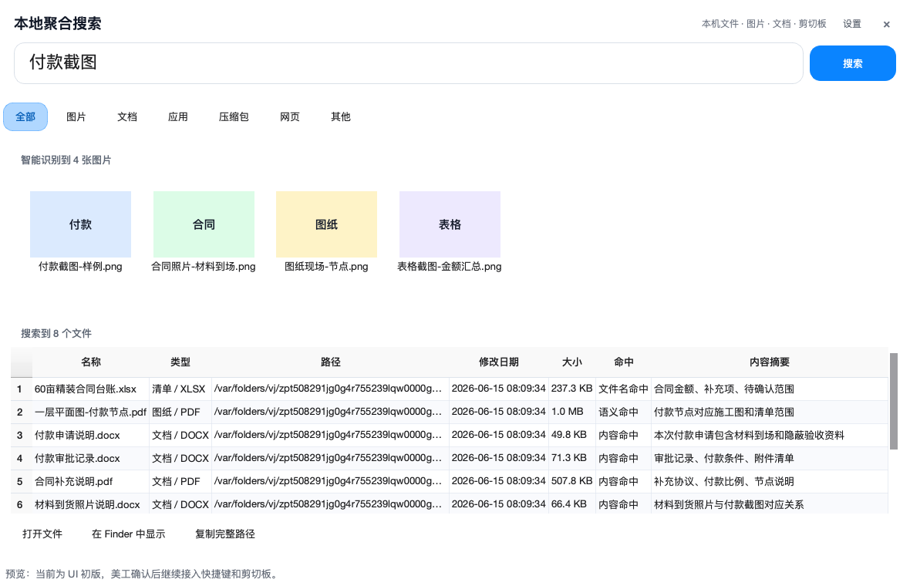

# MacLocalFileManager

MacLocalFileManager 是一个免费开源的 macOS 本地聚合搜索工具。当前版本为 beta1.0。

它的起因很简单：macOS 自带搜索有时候真的让人挠头。

Spotlight 打开 App 很快，但真要找某个 Word、PDF、截图、图纸、压缩包，尤其是中文文件名和一堆工程资料混在一起的时候，经常像在猜谜。Finder 搜索也能用，但入口重、反馈慢，还总让人感觉“它到底搜没搜正文？”

所以我做了这个小工具：打开就是搜索，输入后展开结果，把文件名、路径、文档正文、图片 OCR、分类筛选放到一个更直接的窗口里。不依赖在线 AI，不上传文件内容，索引都留在本机。

A free and open-source Spotlight-like local search tool for macOS. It is built for the moments when Spotlight is too vague and Finder search feels too clumsy.

## 界面预览

折叠态尽量安静，不占屏幕。唤出来就能打字，不用先点进某个文件夹。


输入关键词后自动展开。图片、文件、路径、摘要、筛选都在一个窗口里，不用在 Spotlight、Finder、预览和一堆窗口之间来回切。



## 为什么做这个

不是说 Spotlight 不好。它很适合打开应用、算个数、搜系统项目。

但如果你的电脑里有这些东西：

- 一堆叫“最终版”“最新版”“真的最终版”的文档。
- Word、Excel、PDF 正文里才有关键词，文件名完全看不出来。
- 截图里有付款、合同、发票、图纸节点，但系统搜索基本帮不上忙。
- 工程资料里混着图纸、CAD、清单、压缩包，Finder 搜一次像开盲盒。
- 中文文件名很多，拼音、简称、模糊关键词都想试一试。

那原生搜索体验就开始变得别扭了。

MacLocalFileManager 想解决的就是这些很日常、但很烦人的小问题：

- 打开就是搜索，不需要先进入某个文件夹。
- 输入后直接展开结果，不用等一个小浮窗猜你的意思。
- 图片、文档、应用、压缩包、网页和其他文件可直接筛选。
- 图片结果优先显示缩略图，文档结果显示路径、时间、大小和内容摘要。
- 工程类筛选默认隐藏，普通用户界面更简洁；需要时可在设置中打开图纸 / CAD / 清单。
- 索引保存在本机，不上传文件，也不靠在线 AI 才能工作。

## 现在能做什么

- 类 Spotlight 的无边框半透明窗口。
- 折叠态在屏幕上方黄金分割阅读位打开，输入后展开并居中。
- 可以手动拖动窗口；拖过以后就尊重你的位置，不再自作主张。
- 搜索本地文件名、路径、文档内容、PDF、Office 文档和图片 OCR 文本。
- 图片结果优先以缩略图展示，其他文件以列表展示。
- 支持分类筛选：图片、文档、应用、压缩包、网页、其他。
- 工程类筛选（图纸 / CAD / 清单）默认隐藏，可在设置中打开。
- 有本地离线语义索引基础链路，可使用 Apple Vision 系统能力做图片 OCR、图片标签和相似图片特征，不调用在线服务。
- 默认跳过系统目录、应用目录、用户 Library、外接盘和开发依赖目录。
- 不删除文件，只维护本地 SQLite 索引。

## 安装使用

目前发布的是初始可用版，macOS 上可直接使用本地打包产物：

```text
MacLocalFileManager/dist/MacLocalFileManager.dmg
MacLocalFileManager/dist/MacLocalFileManager-English.dmg
```

打开 DMG 后将 App 拖到 Applications。由于当前未做 Apple notarization，第一次打开可能需要右键 App 选择“打开”。中文用户建议下载默认版；英文用户可下载 English 版。

## 源码运行

```bash
cd MacLocalFileManager
python3 -m venv .venv
source .venv/bin/activate
pip install -r requirements.txt
python app.py
```

索引数据库保存在：

```text
~/Library/Application Support/MacLocalFileManager/file_index.sqlite3
```

## 打包

生成 macOS App：

```bash
cd MacLocalFileManager
packaging/build_macos_app.sh
```

生成 DMG：

```bash
cd MacLocalFileManager
packaging/build_dmg.sh
```

## 测试

```bash
cd MacLocalFileManager
.venv/bin/python -m unittest discover -s tests
```

## 开源协议

本项目采用 MIT License，免费开源。

## 支持项目

如果这个工具对你有帮助，欢迎给项目一个 Star。

如果愿意支持后续开发，也欢迎自愿打赏。二维码收款图会在后续版本补充到这里。

## 状态说明

这是一个 beta1.0 早期可用版，当前优先打磨 macOS 本地搜索体验。图片 OCR、图片标签识别和 FeaturePrint 相似图片特征优先借助 Apple Vision 系统能力；后续计划包括全局快捷键、菜单栏入口、无感唤起、更加稳定的索引刷新机制和更完善的本地图文理解能力。
